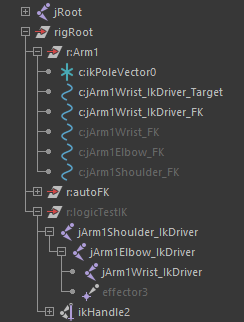
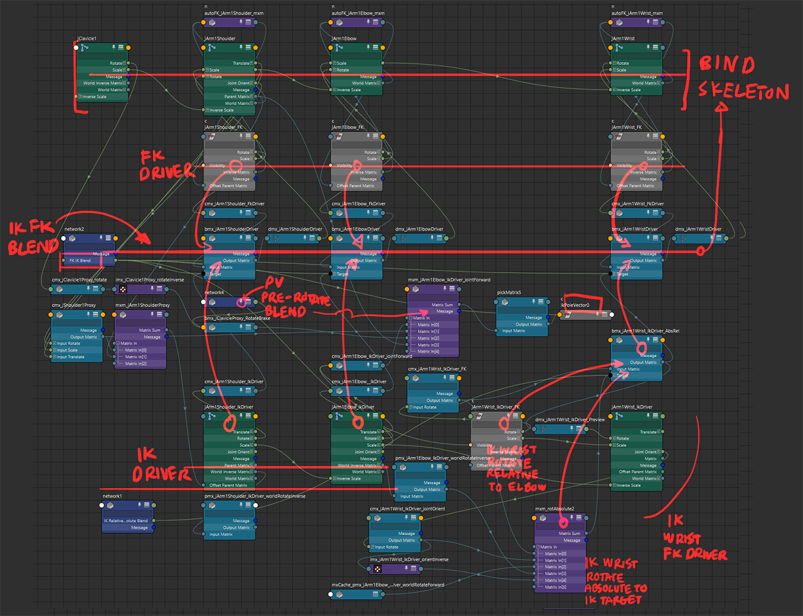
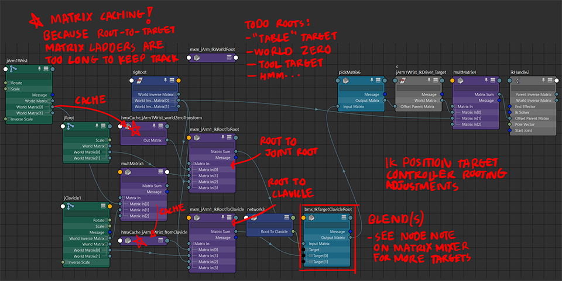
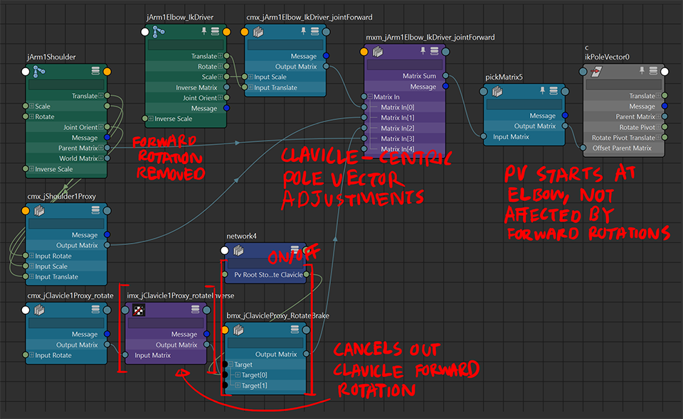

# Journal: FK-IK Blending Revision...
... and preparation for autoIK.py

(part 1 of n)

`TODO` for scripting towards autoIK.py:
- `multMatrix` variant function for quickly removing forward-rotations from a section of a joint chain
	- notes on multMatrix: [here](../mayaNodeStuff/mNode_multMatrix.md)
	- not sure if i should make this a utility function or just code and comment directly each time i need to do this. had a need for this multiple times in the dino rig project
- `rename` (and add renaming to existing functions)
- `ikHandle` utility function, must catch returns to hold IK handle for reparenting and nodework
- `pole vector constraint` utility function
	- notes on IK handles: [here](../mayaNodeStuff/mNode_ikHandle_ikEffector.md)
- blendWeighted matrix mixer. more info [here](../mayaNodeStuff/mNode_blendMatrix.md)
- "matrix caching" `holdMatrix` utility function: for long one-time matrix multiply results that don't need re-evaluation past creation
	- explained below
- discrete utility functions:
	- `pickMatrix` (for picking out or only using rotations etc)
	- `composeMatrix` (quickly cast transform components to matrices)
	- `decomposeMatrix` (quickly grab transform components from matrices)
	- `inverseMatrix` (invert transforms)
- selection validation functions:
	- selecting the sub-hierachy between two joints(?)

note: "**forward rotations**" refer to the `joint.rotate` attribute (the animation-facing attribute), rather than the `joint.jointOrient` rotation or the combined transform in the `joint.matrix` result

# rig demo
 
 
 
 
note: second slider controls root of pole vector controller

# node diagrams

### overview map

### FK-IK switching map

### IK Target root adjustments

on the use of "matrix caching" `holdMatrix` node here:

the aim of the result of this matrix value is to get the position of the wrist relative to the root of the joint chain, unmoved.

the regular way would to climb the entire chain from the root to the wrist (+1 connection per joint to the `multMatrix`), and remove all the forward rotations along the way (+1 `composeMatrix` and +1 connection per joint to the `multMatrix`).

(the `multMatrix` ladder would be `2n-1` long and contain `n+1` nodes, so imagine going from root to hip to spin chain to arm chain ending at wrist.)

the shortcut, is to touch `wrist.worldMatrix` to a `holdMatrix`, with no forward rotations, and use that for the `ikTargetController.offsetParentMatrix` connection. this can be done either through porting over attribute values (`getAttr` and `setAttr`), or calculating the matrix cache directly in python and setting the matrix attribute (especially for caching a matrix multiply result)

this way, the initial state (zero rotations) is only calculated once, and simplifies a lot of the node network connections

> the only downside is this easy solution is not dynamic, and requires a manual update if that part of the rig is to be edited after creation. a script could be used for this, and could be excuted before saving (possibly in a "bake and save" manner)

doing the regular way may make more sense when created through the script, in a run-and-forget manner. might be post-creation-editing unfriendly though from the hairy ladder standpoint

**will do a note on matrix caching in [the maya node notes folder](../mayaNodeStuff) at some point in the future**

### Pole Vector root adjustments

### Wrist Rotation basis switch

# other adjustments to add
- noflip pole vector IK
	- requires `aimMatrix` and a center-facing object vector
	- for the script: consider option for regular PV and noflip PV, in case there is a use for regular semi-absolute positioning
- tool-helper IK intermediary targets (works like the both-eyes aim target controller, where the two eye target controllers are under a parent controller)
	- tool targets (like that in unreal engine's additional hand IK target joints)
	- "table" targets (like the eye control described above)
- study use case of two single-chain IKs for arm?
	- for things like leaning elbows on stuff (e.g. table, side of hip) and having the forearm articulate from there?
- curve shape switching on creation time
	- changing values to the `curveShape.create` attribute
- flip some IK setting blend attributes to make intuitive sense