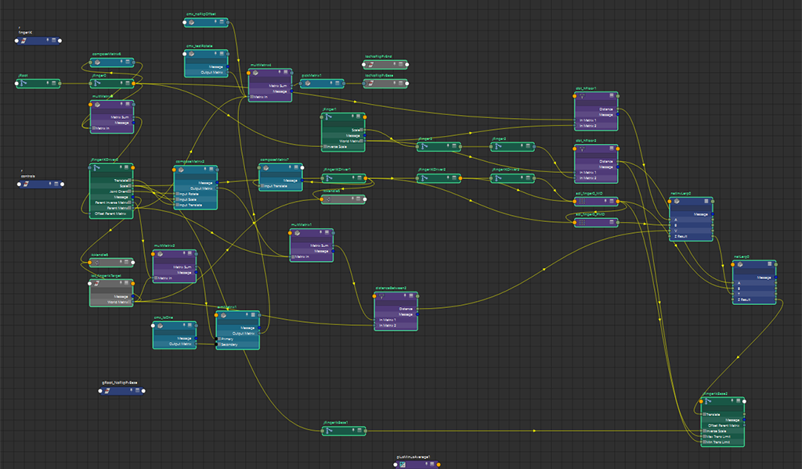

# Converting a selection of nodes in the maya node editor to python commands

**Problem**: writing python code to codify a node network takes a long time due to:
- having to look up the same documentation for the same core command over and over again for each invocation (muscle memory still isn't there yet; also code paranoia and oversimulation in my head)
- increased effort as number of nodes increase

**Goal**: writing python code to write python code

**Considerations and Future Improvements**:
- nodes with complex attributes like `blendMatrix`
  - in manual service, a new `target` has to be made in the attribute editor panel before connecting an attribute to it
- attributes with pre-assigned values instead of an incoming connection, especially `composeMatrix` and other maths and utility nodes (e.g. quick linear scalars)
  - for pre-calculated transforms: it's best to address this after the code printing step
- complex nodes, especially IK solvers and constraints
	- very especially the `message` attribute, will have to skip those
- code adjustment friendliness
  - input nodes/objects are held by a python `list`, so that i can reorder or rename a few things without having to worry too much about program flow or find-and-replace-and-sanityCheck, a step towards a peace of mind
- printing the output to a file
  - currently copying off the script editor, but large networks could easily flood the console with lots of text

## ⬅🔗 [script in separate file due to site parser edge case](https://github.com/STUAAAAAAAAAART/stuaaaaaaaaaart.github.io/tree/main/posts/2024/img/2024/Note/005/scriptScript.py)

the next step after getting the printout, would be to adjust the lines where specific nodes would be retreived from a selection and not created

so selecting these and running the script:

will result in the following output, which is most of the legwork done (looks really daunting to type out by hand in hindsight...)

## ⬅🔗 [example output in separate file due to site parser edge case](https://github.com/STUAAAAAAAAAART/stuaaaaaaaaaart.github.io/tree/main/posts/2024/img/2024/Note/005/scriptScript_output.py)